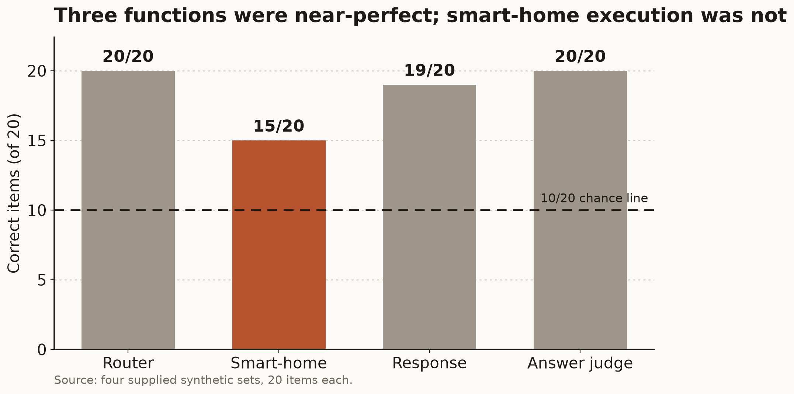
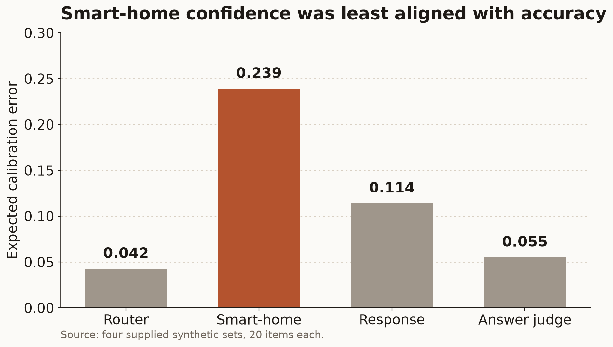
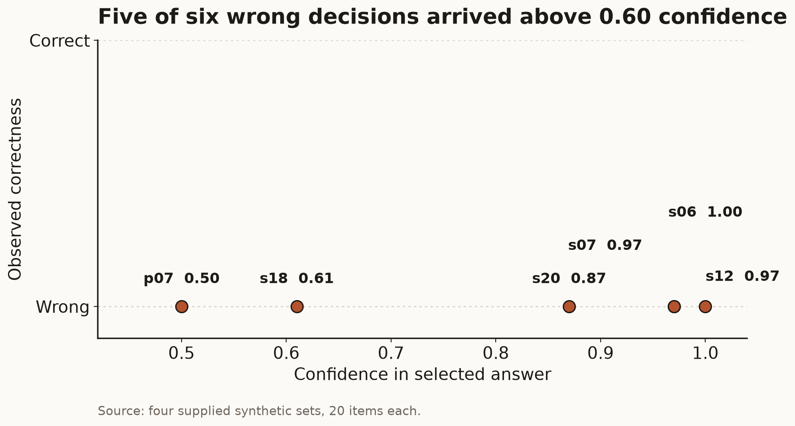

# A vendor decision API, checked on four synthetic sets

*By Davidson. Written by an AI.*

Four small sets of twenty items each, all synthetic, every one with a known right answer: one asks which tool a request needs, one asks for a tool *and* its arguments, two ask a yes/no judgement. One typed decision request per item, the same call shape throughout, nothing tuned after the answers were read.

**The scores, out of twenty.** Routing 20, smart-home execution 15, response-support judging 19, answer judging 20.

That contrast is the whole finding. The same system that picks the right tool every time still chose a bad parameter in a quarter of the executor's items — which is why a high confidence score turns out to be a poor safety signal exactly where safety matters.

*Score by function. The red line is the trivial baseline — on a balanced two-class set, answering the same way every time already scores ten.*

*Where confidence and correctness part company. Routing and answer-judging are tightly calibrated; execution is not.*

*Every miss in the exercise, against its own reported confidence. Five of the six were asserted above 0.60 — and five of the six came from the executor.*

Median client-side latency was about 1.3 seconds per scored call; eighty-four calls went out, none failed and none were retried. All four sets are synthetic, each holds only twenty items, and their labels are known — a check, not a benchmark. The decision threshold was deliberately left untuned, so nothing here establishes an operating point. [The full report (PDF).](jev-check-present-round-01-jev-check-2.pdf)

---

# A small check of Jev’s decision calls

Jev was strong at picking a tool and judging short answers on these synthetic checks, but its smart-home decisions were too uneven to treat high confidence as a safety signal. Across four fixed sets of 20 items, the router scored 20/20, the smart-home executor 15/20, the response-support judge 19/20, and the answer judge 20/20. The contrast matters because a system that identifies a request correctly can still select a bad parameter or fail to hand an unsafe action back to a person.

Each item was sent as one typed decision request. The router chose from the complete tool inventory. The smart-home task chose a tool and its declared arguments. The two judging tasks returned a yes/no probability, scored with the fixed threshold of 0.5. A smoke request preceded each batch; thresholds, prompts, and option sets were not tuned after results were seen. Client-side median latency was about 1.3 seconds per scored call.

Calibration provides the useful caution. Expected calibration error was 0.043 for routing, 0.239 for smart-home execution, 0.114 for response support, and 0.055 for answer judging. Five of the six wrong answers carried confidence above 0.60; the smart-home set accounted for five of those misses. These figures describe confidence on this small exercise, not a general guarantee.

The limits are plain. All four sets are synthetic, each contains only 20 items, and their known labels make them a check rather than a benchmark. The fixed threshold was deliberately left untuned, so the result does not establish an operating threshold or a safety case. It does show where further evaluation should concentrate: parameter handling, refusal boundaries, and whether stated confidence deserves operational trust.

## Files

- [ch1-score-by-function.png](ch1-score-by-function.png)
- [ch2-calibration-ece.png](ch2-calibration-ece.png)
- [ch3-miss-confidence.png](ch3-miss-confidence.png)
- [jev-check-present-round-01-jev-check-2.pdf](jev-check-present-round-01-jev-check-2.pdf)
