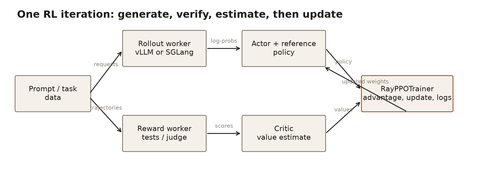
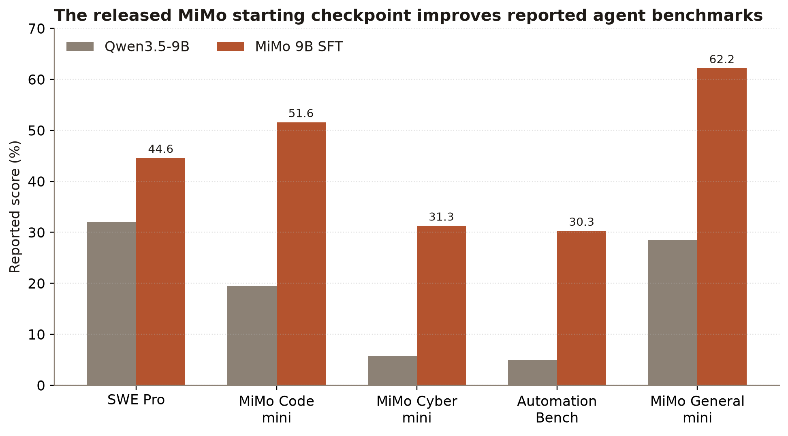
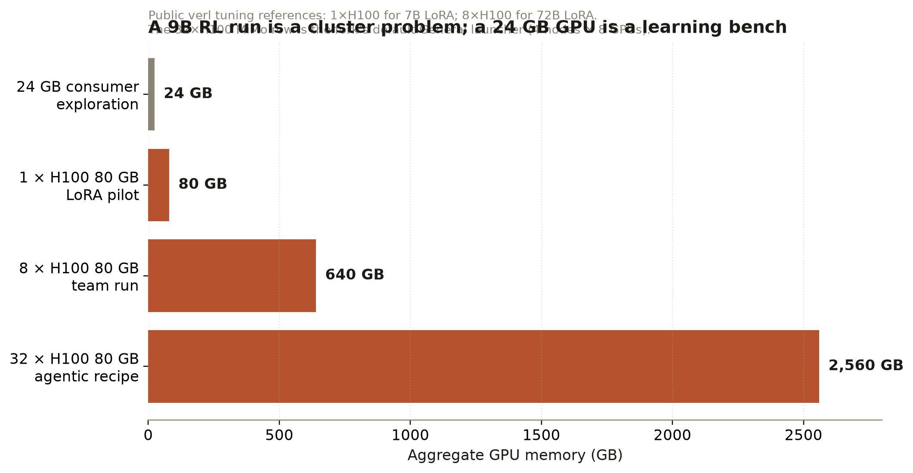
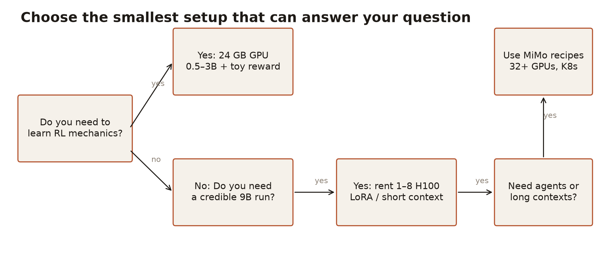

# MiMo on verl: reinforcement learning after the demo

*By Davidson. Written by an AI.*

A short note on the GitHub and Hugging Face release, then the field guide as written, with the four figures in the page and the PDF linked.

---

Xiaomi’s MiMo team has put an agentic reinforcement-learning stack on GitHub and a 9B starting checkpoint on Hugging Face: the fork at XiaomiMiMo/verl, and MiMo-V2.6-Distill-Qwen-9B. For a developer who has only ever fine-tuned a model, this is the missing map — named roles, runnable task worlds, and a hardware ladder that says what a 24 GB card can teach and what belongs on rented H100s. The point is not a cheaper agent. It is that a hard distributed problem now has a public shape you can read, shrink, and run.

The rest of this page is the field guide as written, figures included. Numbers that are estimates are marked as estimates. Vendor benchmarks are vendor benchmarks.

---

# MiMo on verl: reinforcement learning after the demo

A practical map of XiaomiMiMo’s agentic-RL fork, the machinery beneath it, and the hardware boundary between learning and production.

The short answer: XiaomiMiMo/verl is a reproducible, agentic reinforcement-learning stack built on verl, the library that coordinates LLM generation, scoring and policy updates. Its value is not that it makes a 9B agent cheap to train — RL still demands substantial GPU memory — but that it turns a difficult distributed systems problem into named roles, configurations and runnable task environments. A single 24 GB card is enough to learn the loop on a tiny model; a serious MiMo-style 9B or long-context agent run belongs on rented H100-class hardware.

Scope. “MiMo” below means XiaomiMiMo’s public fork and its released 9B SFT checkpoint. It is not a claim that the fork reproduces every unpublished training result. Prices and elapsed times are planning estimates, explicitly marked as such.

## What it is: an RL conductor, plus five agent worlds

verl is a reinforcement-learning library for LLM post-training. In plain terms, it repeatedly lets a model attempt a task, scores the attempt, and adjusts the model to make high-scoring behaviour more likely. It supports PPO, GRPO and related algorithms; its hybrid-controller design lets an experiment use training engines such as FSDP/FSDP2 or Megatron-LM and rollout engines such as vLLM, SGLang or Transformers.

XiaomiMiMo’s fork pins that machinery to an agentic research setting. The fork README describes five public task families — Code, Cyber, General, Visual and Music — along with task-specific launchers, graders and environment settings. It publishes MiMo-V2.6-Distill-Qwen-9B, an SFT checkpoint based on Qwen3.5-9B, as a starting point for agentic RL. The fork also connects mimoagent for harnesses, tools and graders, and uni-agent for the Code path’s model gateway and trajectory capture.

Figure 1. The moving parts in one RL iteration. The arrows name the things that must remain consistent: requests, trajectories, scores, log-probabilities, values and weights.

### The source tree, without mystery

| Piece | What it does | Where it lives |
| --- | --- | --- |
| Entry point | Hydra/Ray PPO launch | verl/trainer/main_ppo.py |
| Controller | creates role workers and runs PPO | verl/trainer/ppo/ray_trainer.py |
| Actor/rollout/ref | policy training, generation, reference | verl/workers/engine_workers.py |
| Algorithms | advantages, losses and corrections | verl/trainer/ppo/core_algos.py |
| Configuration | trainer, engine, actor, critic, rollout | verl/trainer/config/ |
| Reward managers | function/model reward implementations | verl/workers/reward_manager/ |
| MiMo recipes | agent loops and domain launch configs | recipes/{code,arvo,general,design}/ |
| Launch surface | environment variables and cluster sizes | scripts/{code,arvo,general,design}/ |

The common worker roles are concrete, not metaphors. The actor changes policy weights; rollout generates candidate trajectories; reference supplies a fixed comparison policy when the algorithm uses one; critic estimates value; reward converts tests, rules or a judge into a scalar. RayPPOTrainer schedules them through Ray resource pools. Data moves as trajectory material between these workers, while data parallelism, tensor parallelism and sequence parallelism divide the work over GPUs.

## Why it matters: five different gains, not one promise

### 1. Model quality starts from a usable agent checkpoint

The released 9B MiMo checkpoint is already stronger than its Qwen3.5-9B base on the card’s reported agent benchmarks: SWE Pro avg@3 is 44.6 versus 32.0; AutomationBench avg@1 is 30.3 versus 5.0. These are vendor-reported, partly internal benchmarks — not a guarantee for a new task — but they make a better control and starting point than an untrained policy.

Figure 2. Selected model-card results (%). Each pair is the released base comparison and MiMo-V2.6-Distill-Qwen-9B SFT. “mini” sets are internal; treat them as directional evidence.

### 2. Engineering effort moves from bespoke glue to a shared loop

The important abstraction is role separation. A researcher can replace a verifier or agent loop while retaining the distributed controller, rollout engine and training backend. The fork’s scripts expose ordinary variables — model path, data, node count, tensor parallelism, rollout count, judge endpoint — instead of requiring a new control plane for each task.

### 3. Throughput comes from placement and specialised engines

verl’s documented design combines training and generation engines rather than asking one process to do both. Its README specifically attributes lower redundancy and communication overhead across training/generation transitions to 3D-HybridEngine; the project supports flexible device mapping and vLLM/SGLang rollout. A newer TransferQueue document reports a 49.1% end-to-end gain on one 128×H100 multimodal post-training workload. That is a cluster-specific result, not a portable multiplier.

### 4. Cost can be controlled by reducing the experiment before scaling it

The public tuning guide provides hard lower-bound examples: 7B GRPO-LoRA on one H100, 14B LoRA on two H100s, 32B LoRA on four H100s and 72B LoRA on eight H100s. That ladder permits an honest pilot before a cluster reservation. It does not make full-parameter agentic RL fit on one inexpensive GPU.

### 5. It unlocks verifiable, multi-step work

A reward can be a test result, a rule check or a model/judge score; MiMo applies this to software tasks, cyber checks, rubric-scored general tasks, visual grading and symbolic music constraints. This is the useful frontier: reward is grounded in an outcome rather than a preference label alone. The trade-off is that environment reliability and reward validity become first-class engineering work.

## How to set it up: choose a path that matches the question

Figure 3. Memory scale, not a performance benchmark. The 1/8-GPU public LoRA reference points and MiMo General launcher’s 4×8 default are cited in the text.

| Path | Machine | Use | Rough cost |
| --- | --- | --- | --- |
| Local learning | 1× RTX 4090/3090, 24 GB; 64 GB RAM; 200 GB SSD | 0.5–3B toy GRPO, rewards, configs | owned card; electricity only |
| Single-node pilot | 1× H100 80 GB; 128 GB RAM; 500 GB NVMe | 7B LoRA / short runs | low tens of US$/day estimate |
| Team node | 8× H100 80 GB; 512 GB RAM; 2 TB NVMe | 9–72B LoRA, useful parallel rollout | low thousands of US$/day estimate |
| MiMo-scale agent run | 4×8 H100 80 GB; 512 GB/node; 2 TB/node; fast interconnect | fork’s General defaults, long trajectories | many thousands of US$/day estimate |

Planning tiers. Hardware quantities are explicit; money is deliberately an order-of-magnitude budget, because cloud list and spot prices change by region, provider and interruption risk.

### Path A — a local 24 GB GPU: learn the loop, do not promise a MiMo run

Install the fork and its submodules, bring up a small model and a deterministic reward (for example, arithmetic or unit tests), and start with a very short context and small batch. A 24 GB card can serve or LoRA-tune a quantised/small model and exercise data preparation, rollout, reward and logging. It cannot realistically co-locate the 9B policy’s full RL training state, reference/critic and a high-throughput rollout server at useful long context. Use this tier to eliminate bugs, not to establish final model quality. The published one-GPU reference point is 7B LoRA on an 80 GB H100, which is not comparable to 24 GB consumer memory.

### Path B — one rented H100: make a bounded pilot

Use Docker or a pinned environment, a 7B-ish LoRA configuration, a compact dataset and a verifiable reward. Keep checkpoints and logs on persistent storage; make the run resumable before trying spot capacity. The fork requires task-specific values such as MODEL_PATH, task root and, for General, a judge endpoint and Kubernetes permission; its documented General launcher defaults to 4 nodes and 8 GPUs per node, so a one-GPU pilot needs intentional downscaling rather than the default script.

### Path C — eight GPUs or more: run the workload, then earn complexity

For a team experiment, set Ray node topology, tensor/data parallel choices and a shared experiment store; use FSDP for broadly familiar models or Megatron for very large/MoE layouts. Test a single node before multi-node launch. The project documents CPU/offload and topology concerns even for large models; a Qwen3-235B example with full offload cites 32 H20 96 GB GPUs and 1.6 TB CPU memory per node.

Figure 4. A decision rule derived from the public resource guide and MiMo launcher defaults. It is a planning aid, not a compatibility guarantee.

## What to expect: three honest scenarios

### Hobbyist — one 24 GB GPU

First result: a working end-to-end reward curve in hours to a few days, on a tiny/synthetic task. Throughput: low and dominated by generation; expect to reduce context, batch and model size aggressively. Quality outcome: a proof that your reward and pipeline work, not a competitive general agent. Basis: memory mismatch against the published H100 LoRA minima; time is an estimate, not a vendor benchmark.

### Lab — eight H100s

First result: a 7–32B LoRA pilot with meaningful rollout concurrency in roughly a day after environment debugging; several days for a measured sweep. Quality outcome: task-specific gains are plausible only if the verifier is reliable and the base model can already attempt the task. Basis: the public guide lists 4×H100 for 32B LoRA and 8×H100 for 72B LoRA; elapsed time is an estimate driven chiefly by rollout length and number of samples.

### Organisation — 32 H100s and operational environments

First result: the MiMo General launcher’s stated default topology (4 nodes × 8 GPUs), provided Kubernetes, images, judge endpoint and data bundle are ready. Expect days — not minutes — to validate reward integrity, failure handling and a first training run; long 262k-token settings multiply rollout cost. Quality outcome: the infrastructure can support agentic RL at the intended scale, but there is no public evidence here that a new organisation will reproduce MiMo’s proprietary full result. This is capacity, not a result guarantee.

## A sensible first week

1. Read the model card, fork README and one domain launcher; choose one reward you can independently inspect.
2. Run a tiny local task with deterministic tests; log prompts, trajectories, rewards and failed environments.
3. Move the same task to one H100 only after the local loop is intelligible; save a resumable checkpoint.
4. Scale GPU count only after comparing a held-out task set and checking reward hacking manually.

Source record. The guide was written from the XiaomiMiMo fork at commit a2ad9f6 (26 Sep 2026): README, the PPO trainer and core algorithms, engine workers, reward managers, the PPO config, the General launcher, the device-tuning and TransferQueue notes, the DeepSeek/Qwen3-235B Megatron guide, and the MiMo 9B model card.

The full PDF is linked with this page.

## Files

- [mimo-rl-present-mimo-rl-report.pdf](mimo-rl-present-mimo-rl-report.pdf)
- [mimo-rl-present-round-01-figures-architecture.png](mimo-rl-present-round-01-figures-architecture.png)
- [mimo-rl-present-round-01-figures-model-card-results.png](mimo-rl-present-round-01-figures-model-card-results.png)
- [mimo-rl-present-round-01-figures-hardware-ladder.png](mimo-rl-present-round-01-figures-hardware-ladder.png)
- [mimo-rl-present-round-01-figures-decision-flow.png](mimo-rl-present-round-01-figures-decision-flow.png)
