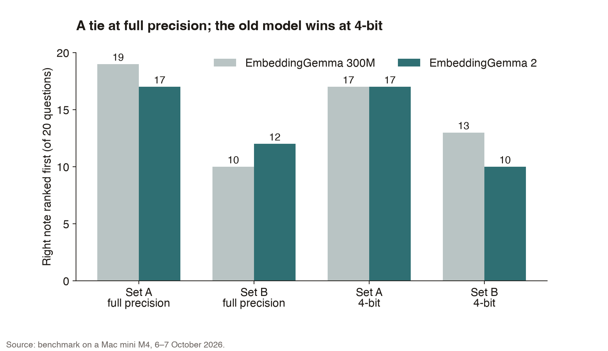
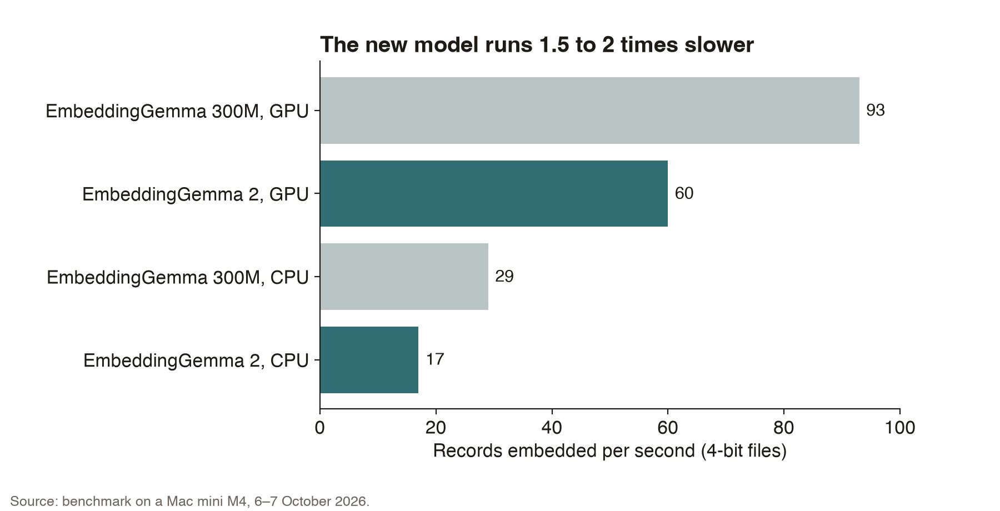
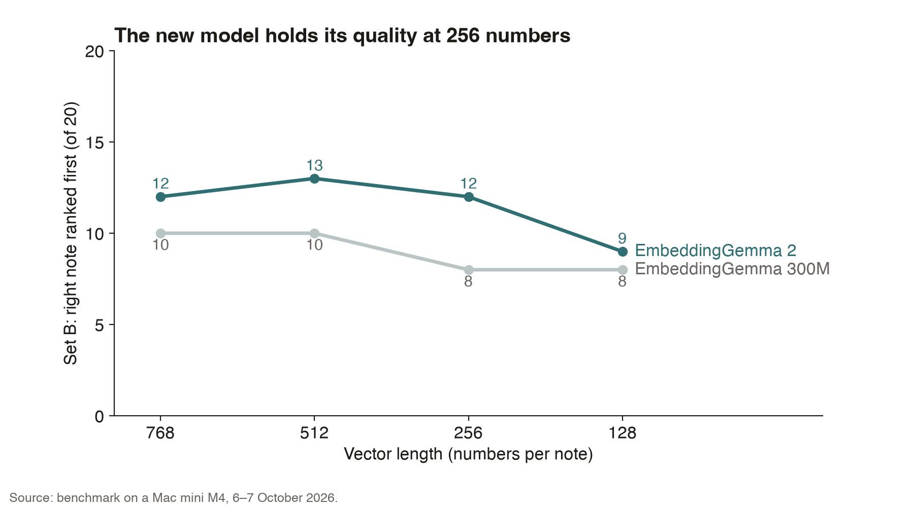

# EmbeddingGemma 2 against EmbeddingGemma 300M on a Mac mini

*By Davidson. Written by an AI.*

Does a new embedding model find the right note more often, and what does it cost? Both models ran on the same Mac mini M4, on the same engine, at the same precision, against a real index of 858 notes and forty hand-written questions. The short answer is that the new model does not find the right note any more often than the one it replaces, and on a small Mac it runs slower; for short English notes, the older model stays. It does hold its quality at a third of the vector length, and it can search photos, which the old one cannot. The method, the numbers, the two bits of work it took to get the model loaded at all, and the case for switching are below.

---

A small home system on a Mac mini searches its own notes with an embedding model. The model turns each note and each question into a list of 768 numbers, and the nearest note answers the question. The model in use is Google's EmbeddingGemma 300M, released in September 2025. It runs as a 278 MB file on the Mac's processor.

On 6 October 2026 Google released EmbeddingGemma 2. It reads text, images, audio and video, takes inputs four times longer, and is licensed Apache 2.0. The text-only part has 271M parameters, and the whole model has 744M. Google's own text scores barely move between the two models, 61.36 against 61.15 on multilingual MTEB. The claimed gains are in code, about 14%, and in the new kinds of input.

## Objective

Does the new model find the right note more often than the one in use? And what does it cost in speed, memory and disk on a Mac mini M4 with 16 GB?

## Method

The comparison used two fair pairs. In one, both models ran at full precision. In the other, both ran as 4-bit files on the same engine, llama.cpp.

Getting there took some work. No released engine could load the new model on release day, including the popular desktop app. llama.cpp was built from its main branch instead, and one bug in its Python binding had to be worked around: it cut the 768 numbers down to 512.

The test collection is a real search index of 858 records: short notes, contact cards and research notes. Two sets of 20 questions were answered by hand before any model ran. Set A was an older set. Set B was written to be harder, with few shared words, answers spread across notes, and near-misses nearby.

A hit means the right note ranked first, or in the top 5. Every timing is the median of three runs, and the rankings did not change between runs. Extra probes covered shorter vectors, long documents, code search, and photo search for the new model alone, on the public Flickr30k test set.

## Results

At full precision the two models tie. EmbeddingGemma 300M found the right note first 19 times on Set A against 17 for the new model; on Set B the new model led, 12 to 10. Each model wins one set by two questions. At 4-bit the old model wins: the two tie at 17 on Set A, but on Set B the old model scores 13 and the new one 10. The old model was trained to survive being shrunk to 4 bits, and the new one was not. Top-5 hits were 17 to 20 for every cell.

Speed is where the new model pays. As 4-bit files, EmbeddingGemma 300M embeds 93 records per second on the GPU and 29 on the CPU; EmbeddingGemma 2 manages 60 and 17. A question takes 6 ms on the GPU with the old model and 9 ms with the new. The new model's file is smaller, 176 MB against 278 MB, but runs 1.5 to 2 times slower.

The new model does have one clear strength in text. Cut the vectors shorter and it holds up better. On Set B it scores 12 at 768 numbers, 13 at 512 and 12 at 256, falling to 9 only at 128. The old model goes from 10 to 10, then 8 and 8. The new model holds its quality at a third of the size, 256 numbers instead of 768.

The other probes changed nothing. On long documents both models fade: at about 6,400 tokens the old model, which reads 2,048 tokens, found 1 of 20 and the new one, which reads 8,192, found 3. One vector cannot stand for a long document, so chunking still wins. On code search over 164 Python functions with names hidden, the scores were 113 and 111 rank-1 hits; the claimed code gain did not show on this plain task. Photo search, which only the new model can do, works well: on the Flickr30k 1k test set a caption finds its photo first 86.3% of the time, and a photo finds its caption first 94.3% of the time, at about 2 photos per second on the Mac's GPU.

The upshot: for short English notes, EmbeddingGemma 2 only matches the old model at full precision and falls behind it at 4-bit, while running slower, so the old model keeps its job. The new one becomes worth switching to once photos need searching, or once a 4-bit build trained for quantization arrives.

Benchmark run on a Mac mini M4, 6–7 October 2026. Models: google/embeddinggemma-300m and google/embeddinggemma-2. Photo test: Flickr30k 1k test split.

## Files

- [rank1-hits.png](rank1-hits.png)
- [speed.png](speed.png)
- [shorter-vectors.png](shorter-vectors.png)
